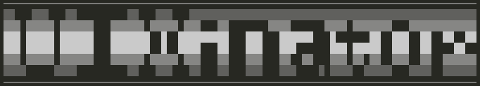

# UIXinator
 
A selection of tools to automate some of the setup and customization process of [UIX Lite](https://github.com/OfficialTeamUIX/UIX-Lite)

> [!WARNING]  
> This project is in "beta". 
> It is unfinished and sloppy. 
> But it does work, but it also needs work.

# Pre-requirements
You should have [UIX Lite](https://github.com/OfficialTeamUIX/UIX-Lite) already installed and setup. 
Might build a tool for this lator, idk 
Some sort of FTP server running on your dashboard, whether this be another custom dashboard or a dedicated FTP app.

# Setup (Windows)
Sadly right now the pre-built release pack only contains windows binaries. 
(If you know how to python things, you can just use the `Iconinator.py` from this repo, and make sure you have requests lib installed) 
1. Download and extract to a folder the latest build of UIXinator ([UIXinator-20240823.zip](https://github.com/MobCat/UIXinator/releases/download/build/UIXinator-20240823.zip)).
2. Turn your xbox on, make sure it's FTP server is running and it's on the same network as your computer.
3. Run one of the included tools, for eg `Iconinator.exe` at least once.
4. On first launch of any UIX tool in this pack, you will be prompted to setup a `settings.ini` file, just follow the prompts. 
Basically you just need to enter the end of your xboxs IP, and make sure it's turned on, running it's FTP server and connected to the same network as your computer, easy peasy. 

Once you have made this `settings.ini` file once, you won't need to do it again. running the tool exe again will auto load the `settings.ini`. 

"Pro tip": If you have more then one xbox in your house, rename `settings.ini` to something like `GamesRoomXBox.ini` 
Then drag'n'drop it to the tool you want to use, and it will now connect to your xbox using the custom settings ini.

# Iconinator
A tool that automates the process of setting up launcher icons 
This tool will connect to your xbox via FTP, download a list of all the games you have currently installed on your xbox, 
build your custom `icons.xbx` list based on this content, re-upload it to your xbox, then download and install custom icon packs. 

TODO: Figure out how to batch build an xip from the command line or within python it's self. So we can auto build custom icon packs. 
TODO2: Once pyxbe is working, we should be able to remove the XBEJson dependency. 
Might be able to just rip icons directly from xbxs with pyxbe too, but Idk if that's going to work for homebrew or old xbox games, titles pre XDK 4928.. 
Really pre XDK 5849 but idk when the spec for icons was fully locked in.  

# How to Build from source
TODO:  

But make sure you have python 3.10.4 or newer installed, install the requests and cx_Freeze libs. 
Install 7-zip. You should already have 7-zip..? 
And then run the `buildEXEs.bat` to build the python exes and make a zip of the whole app for upload.
